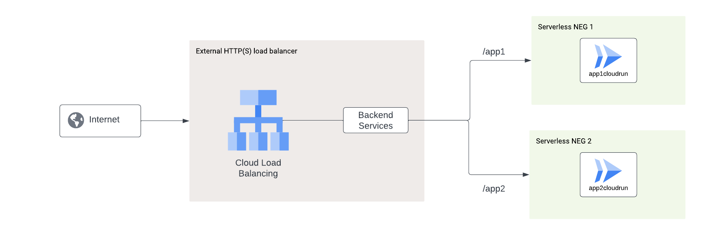

# HTTPS load balancer with Serverless NEG backend example (Cloud Run)

(https://console.cloud.google.com/cloudshell/open?git_repo=https://github.com/GoogleCloudPlatform/terraform-google-lb-http&working_dir=examples/cloudrun-urlmap&page=shell&tutorial=README.md)

  

This example deploys two Cloud Run applications, creates a Serverless Network

Endpoint Group (NEG) and exposes it behind a Cloud HTTPS load balancer with a urlmap that defines routing capabilities to the different cloud run services.

### Architecture diagram
 

## Change to the example directory

```
[[ `basename $PWD` != cloudrun ]] && cd examples/cloudrun
```

## Install Terraform

1. Install Terraform if it is not already installed (visit
   [terraform.io](https://terraform.io) for other distributions):

## Set up the environment

1. Set the project, replace `YOUR_PROJECT` with your project ID:-

```
PROJECT=YOUR_PROJECT
```

```
gcloud config set project ${PROJECT}
```

2. Configure the environment for Terraform:

```
[[ $CLOUD_SHELL ]] || gcloud auth application-default login
export GOOGLE_PROJECT=$(gcloud config get-value project)
```

## Run on HTTPS load balancer (with HTTP-to-HTTPS redirect)

This options creates a Google-managed SSL certificate for your domain name,
sets it up on HTTPS forwarding rule and creates a HTTP forwarding rule to
redirect HTTP traffic to HTTPS.

1. Make sure you have a **domain name**. This is required since we provision a
   Google-managed SSL certificate specifically for this domain name.

1. Initialize:

    ```
    terraform init
    ```

1. Deploy the load balancer, replace `example.com` with your domain name.

    ```
    terraform apply -var=project_id=$PROJECT \
        -var=domain=example.com
    ```

1. After the deployment completes, the load balancer with 2 backends should have an IP associated with it. Take this IP address and go to the CPanel of your domain and update the @ record to point to this ip. It may take a while to update.

1. It may take around half an hour for the SSL certificate to be provisioned
   and the application to start serving traffic.


   Note: If IP address is not provisioned on the load balancer, try manually provisioning an IP address frontend for the specified load balancer.

<!-- BEGINNING OF PRE-COMMIT-TERRAFORM DOCS HOOK -->
## Inputs

| Name | Description | Type | Default | Required |
|------|-------------|------|---------|:--------:|
| domain | Domain name to run the load balancer on. Used if `ssl` is `true`. | `string` | n/a | yes |
| lb\_name | Name for load balancer and associated resources | `string` | `"tf-cr-lb"` | no |
| project\_id | n/a | `string` | n/a | yes |
| region | Location for load balancer and Cloud Run resources | `string` | `"us-central1"` | no |
| ssl | Run load balancer on HTTPS and provision managed certificate with provided `domain`. | `bool` | `true` | no |

## Outputs

| Name | Description |
|------|-------------|
| load-balancer-ip | n/a |

<!-- END OF PRE-COMMIT-TERRAFORM DOCS HOOK -->
