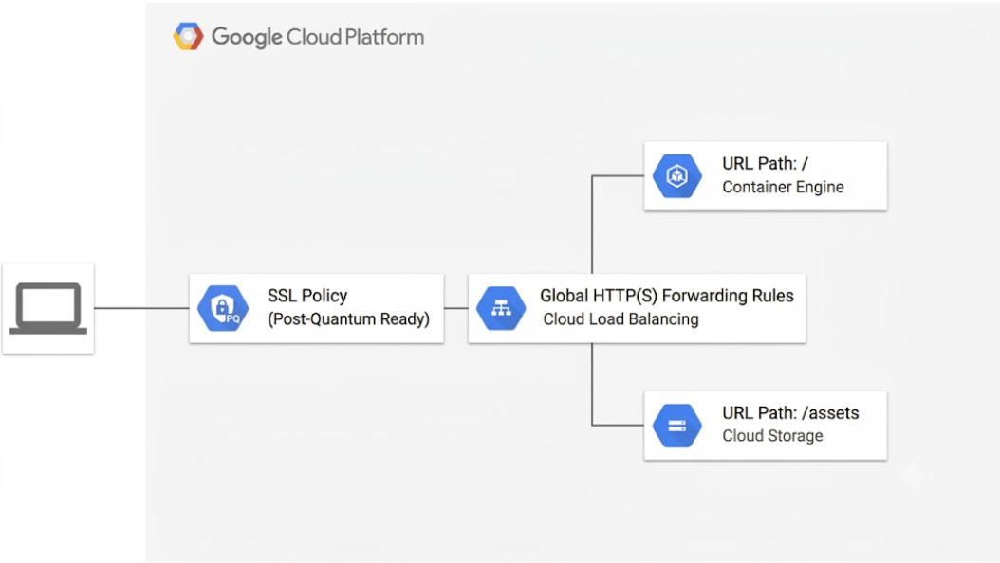

# HTTPS load balancer with GKE cluster and Post-Quantum Cryptography (PQC) example

[](https://console.cloud.google.com/cloudshell/open?git_repo=https://github.com/terraform-google-modules/terraform-google-lb-http&working_dir=examples/pqc-https-gke&page=shell&tutorial=README.md)

This example creates an HTTPS load balancer that forwards traffic to a GKE cluster with **Post-Quantum Cryptography (PQC)** enabled via a custom SSL Policy.

The infrastructure includes:
- A Global HTTPS Load Balancer.
- A `google_compute_ssl_policy` with `post_quantum_key_exchange` enabled.
- A URL map routing traffic to GKE NodePorts.
- A Cloud Storage backend for static assets (`/assets`).
- Self-signed certificates generated via the TLS provider.

**Note:** The `post_quantum_key_exchange` feature requires a supported Google Cloud Region and Provider version.

## Architecture

**Figure 1.** *diagram of Google Cloud resources*



## Change to the example directory

```
[[ `basename $PWD` != pqc-https-gke ]] && cd examples/pqc-https-gke
```

## Install Terraform

1. Install Terraform if it is not already installed (visit [terraform.io](https://terraform.io) for other distributions):

## Set up the environment

1. Set the project, replace `YOUR_PROJECT` with your project ID:

```
PROJECT=YOUR_PROJECT
```

```
gcloud config set project ${PROJECT}
```

2. Configure the environment for Terraform:

```
[[ $CLOUD_SHELL ]] || gcloud auth application-default login
export GOOGLE_PROJECT=$(gcloud config get-value project)
```

## Option 1 - Example using new cluster

1. Deploy a new GKE cluster with a named node port:

```
(
    cd gke-node-port/
    terraform init
    terraform plan -out terraform.tfplan
    terraform apply terraform.tfplan
)
```

2. Export the instance group URI, node tag, network name and Project ID as Terraform environment variables:

```
export TF_VAR_backend=$(terraform output -raw -state gke-node-port/terraform.tfstate instance_group)
export TF_VAR_target_tags=$(terraform output -raw -state gke-node-port/terraform.tfstate node_tag)
export TF_VAR_network_name=$(terraform output -raw -state gke-node-port/terraform.tfstate network_name)
export TF_VAR_project=$GOOGLE_PROJECT
```

3. Run Terraform to create the load balancer:

```
terraform init
terraform apply
```

## Post-Quantum Cryptography Validation

After deployment, you can verify that the SSL Policy has PQC enabled:

```bash
SSL_POLICY_NAME=$(terraform output -raw ssl_policy_name)
gcloud compute ssl-policies describe ${SSL_POLICY_NAME} --format="get(postQuantumKeyExchange)"
```

Expected output: `ENABLED`

### Deeper Client-Side Validation

To perform a deeper client-side validation using modern `curl` and `openssl` (with PQC enabled), you can run the following commands:

1. **Verify with `curl` using the `X25519MLKEM768` hybrid group:**

```bash
LOAD_BALANCER_IP=$(terraform output -raw load_balancer_ip)

# Test the TLS handshake using the post-quantum curve via docker
docker run --rm openquantumsafe/curl curl -v --tlsv1.3 --tls-max 1.3 --curves X25519MLKEM768 -k -I "https://${LOAD_BALANCER_IP}.nip.io/assets/gcp-logo.svg"
```

*(Note: `-k` is used since the certificates generated in this example are self-signed).*

2. **Inspect the negotiated key exchange group using `openssl`:**

```bash
openssl s_client -tls1_3 -groups "${PQC_CURVE}" -connect "${LOAD_BALANCER_IP}:443" -brief </dev/null
```

This will output details of the brief handshake, highlighting that the negotiated key exchange group is indeed `X25519MLKEM768`.

## Cleanup

1. Delete the load balancing resources created by terraform:

```
terraform destroy
```

2. (Option 1 only) Delete the GKE cluster:

```
cd gke-node-port/
terraform destroy
```

<!-- BEGINNING OF PRE-COMMIT-TERRAFORM DOCS HOOK -->
## Inputs

| Name | Description | Type | Default | Required |
|------|-------------|------|---------|:--------:|
| backend | The instance group to add to the backend | `string` | n/a | yes |
| name | The name for the load balancer and associated resources | `string` | `"tf-lb-https-gke"` | no |
| network\_name | The name of the network to create the load balancer in | `string` | `"default"` | no |
| project | The project ID | `string` | n/a | yes |
| service\_port | The port on the node to connect to | `string` | `"30000"` | no |
| service\_port\_name | The name of the port on the node to connect to | `string` | `"http"` | no |
| target\_tags | The target tags for the firewall rules | `string` | `"tf-lb-https-gke"` | no |

## Outputs

| Name | Description |
|------|-------------|
| load\_balancer\_ip | The external IPv4 address of the load balancer |
| load\_balancer\_ipv6 | The IPv6 address of the load-balancer, if enabled; else "undefined" |
| project\_id | The project ID |
| ssl\_policy\_name | The name of the SSL policy with PQC enabled |

<!-- END OF PRE-COMMIT-TERRAFORM DOCS HOOK -->
